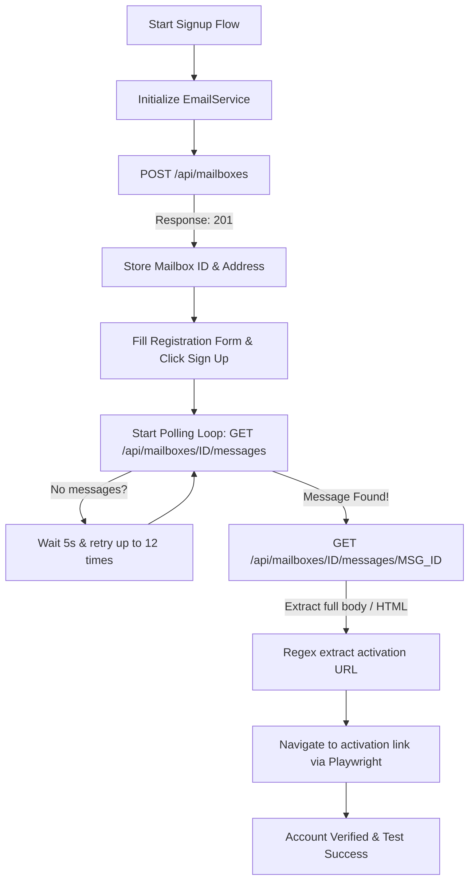

# QA Intern Technical Assignment

## Overview

This repository contains my submission for the **QA Intern Technical Assignment**. The objective of this assignment is to demonstrate manual testing, defect reporting, and automation testing skills for the Login and Signup functionality of the application.

The project includes:

- Manual Test Case Documentation
- Defect Report
- Automation Source Code
- Automation Execution Report

The automation framework is built using **Python**, **Playwright (Sync API)**, **Pytest**, and follows the **Page Object Model (POM)** design pattern to ensure scalability, maintainability, and code reusability.

---

# Assignment Deliverables

## ✅ Task 1 – Test Case Creation

Prepared comprehensive manual test cases covering the Login and Signup functionality.

### Coverage
- Positive Test Cases
- Negative Test Cases
- Boundary Value Testing
- Input Validation
- UI Validation
- Navigation Testing
- Security Validation
- Functional Testing

**Deliverable**
- [QA_Test_Cases.xlsx](QA_Test_Cases.xlsx)

---

## ✅ Task 2 – Defect Reporting

Created a professional defect report for the identified issues.

**Reported Defects**
- DEF-001: Login page allows users to proceed with an invalid email format.
- DEF-002: Unregistered email login redirects to signup page without displaying an error message.

**Deliverable**
- [Defect_Report.pdf](Defect_Report.pdf)

---

## ✅ Task 3 – Automation Testing

Automated the Login and Signup functionality using **Python**, **Playwright (Sync API)**, and **Pytest** following the **Page Object Model (POM)** design pattern.

### Automated Scenarios

- **Valid New User Signup & Verification:** Creates account, retrieves activation URL via ThrowawayMail API, and verifies session.
- **Valid Login with Verified Account:** logs in using newly created credentials and verifies redirection.
- **Invalid Login Password Validation:** Attempts login with an incorrect password and verifies validation responses.
- **Empty Email Validation:** Verifies that leaving the email address field blank blocks login.
- **Empty Password Validation:** Verifies that leaving the password field blank blocks submission.
- **Invalid Email Format Validation:** Confirms invalid/malformed email format handling.
- **Common Email Domain Typo Validation:** Verifies warning/blocking for typos like `gmal` instead of `gmail`.
- **SQL Injection (SQLi) Sanitization:** Asserts database error strings are not exposed.
- **HTML/XSS Script Injection Sanitization:** Checks input sanitization for scripts.

---

## ⚙️ Automation Code Architecture & Email Polling Workflow

### 1. ThrowawayMail API Polling Flow

The registration suite integrates with the `ThrowawayMail.app` REST API to automate real-time email verification. Below is the workflow diagram of this implementation:



#### Detailed Polling Steps:
1. **Mailbox Creation:** Sends a `POST` request to `/api/mailboxes` to create a fresh temporary inbox, returning a unique `id` and email `address`.
2. **Form Submission:** The automated script fills out the signup form on Tichi and clicks "Sign Up".
3. **Inbox Polling:** Every 5 seconds (up to 12 attempts), the test queries `/api/mailboxes/{id}/messages` to check for incoming verification emails.
4. **Message Details Retrieval:** Once a message is detected, it makes a detailed `GET` request to `/api/mailboxes/{id}/messages/{msg_id}` to fetch the full HTML email body.
5. **Activation Regex:** A regex pattern `https?://tichi-app-webapp-stage\.web\.app/activate/[^\s"]+` parses the body, extracts the activation URL, and loads it to verify the user.

---

### 2. Automation Code Component Design

The framework is highly modular, written in compliance with clean-code principles:

* **[BasePage (Automation Code/pages/base_page.py)](Automation%20Code/pages/base_page.py):** A thin wrapper over Playwright's `Page` object. It centralizes functions like `click()`, `fill()`, and `navigate()`. It handles flaky elements by incorporating safety checks (`force=True` on buttons, blurring/focusing inputs, and handling overlays).
* **[LoginPage (Automation Code/pages/login_page.py)](Automation%20Code/pages/login_page.py):** Implements selectors and actions for the login portal. It manages the multi-step login flow (entering email, clicking Continue, entering password, and confirming navigation to `/dashboard`).
* **[SignupPage (Automation Code/pages/signup_page.py)](Automation%20Code/pages/signup_page.py):** Manages registration fields. It automatically generates dynamic test data (like random 10-digit phone numbers and secure passwords compliant with the 8-15 character limit) and handles checkbox agreements.
* **[EmailService (Automation Code/utils/email_service.py)](Automation%20Code/utils/email_service.py):** A standalone helper wrapper that encapsulates all HTTP calls to the `ThrowawayMail.app` REST API, parsing results and logging API statuses.
* **[test_tichi_auth.py (Automation Code/tests/test_tichi_auth.py)](Automation%20Code/tests/test_tichi_auth.py):** The master test suite containing all 8 validation test cases, leveraging Pytest fixtures to pass states between tests.

---

## ✅ Task 4 – Automation Execution Report

Executed the automated test suite and generated a detailed HTML execution report using **Pytest HTML Report**.

### Report Includes

- Test Execution Summary
- Total Tests Executed
- Passed / Failed Status
- Execution Time
- Detailed Test Logs

**Deliverable**
- [result.html](result.html)

---

# Project Structure

```text
QA-Intern-Technical-Assignment/
│
├── Automation Code/
│   ├── pages/
│   │   ├── base_page.py
│   │   ├── login_page.py
│   │   └── signup_page.py
│   ├── tests/
│   │   └── test_tichi_auth.py
│   ├── utils/
│   │   └── email_service.py
│   ├── conftest.py
│   ├── dump_signup.py
│   ├── pytest.ini
│   └── requirements.txt
│
├── Output images/
│   ├── output1.png
│   └── output2.png
│
├── QA_Test_Cases.xlsx
├── Defect_Report.pdf
├── result.html
└── README.md
```

---

# Tech Stack

- Python 3.x
- Playwright (Sync API)
- Pytest
- Pytest HTML Report
- Page Object Model (POM)

---

# Installation

Clone the repository

```bash
git clone <repository-url>
```

Navigate to the project directory

```bash
cd "Automation Code"
```

Install the required dependencies

```bash
pip install -r requirements.txt
```

---

# Running the Automation Tests

Execute all automated test cases

```bash
pytest
```

Generate an HTML execution report (Pre-configured in `pytest.ini`)

```bash
pytest --html=../result.html --self-contained-html
```

---

# Test Coverage

## Login Module

- Registered User Login
- Invalid Email Validation
- Invalid Password Validation
- Empty Email Validation
- Empty Password Validation
- Password Masking
- Password Visibility Toggle
- Login Navigation
- SQL Injection (SQLi) Sanitization
- Cross-Site Scripting (XSS / HTML) Sanitization

## Signup Module

- New User Registration Flow
- Real-time Email Verification (ThrowawayMail.app API wrapper)
- Required Field Validation
- Agreement Checkbox Validation

---

# Framework Highlights

- **Page Object Model (POM):** Decouples page UI selectors and actions from test scripts.
- **API Email Verification:** Automatically generates disposable mailboxes and polls emails to extract activation links.
- **Robust Locators:** Employs precise Playwright locators for highly resilient DOM interactions.
- **HTML Reporting:** Beautifully custom-styled execution reporting dashboard.
- **Resilient Execution:** Automated retries and safety inputs to handle dynamic validation states.

---

# Assumptions

- Application is available and accessible.
- Stable internet connection is available.
- Playwright browser engines are installed (`playwright install`).

---

# Submission Files

| File / Folder | Description |
|------|-------------|
| [QA_Test_Cases.xlsx](QA_Test_Cases.xlsx) | Manual test cases for Login and Signup functionality |
| [Defect_Report.pdf](Defect_Report.pdf) | Defect report for the identified issues |
| [result.html](result.html) | Automation execution report |
| [pages/](Automation%20Code/pages) | Page Object Model implementation |
| [tests/](Automation%20Code/tests) | Automated test scripts |
| [utils/](Automation%20Code/utils) | Utility classes and helper methods (e.g. Email service) |
| [requirements.txt](Automation%20Code/requirements.txt) | Python project dependencies |
| [README.md](README.md) | Project documentation |

---

# 📊 Test Execution Screenshots

Below are the execution result screenshots captured from the test automation run:

### 1. Test Execution Summary Dashboard


### 2. Detailed Test Logs and Execution Steps


---

# Author

**Nithizh**  
*QA Intern Technical Assignment Submission*